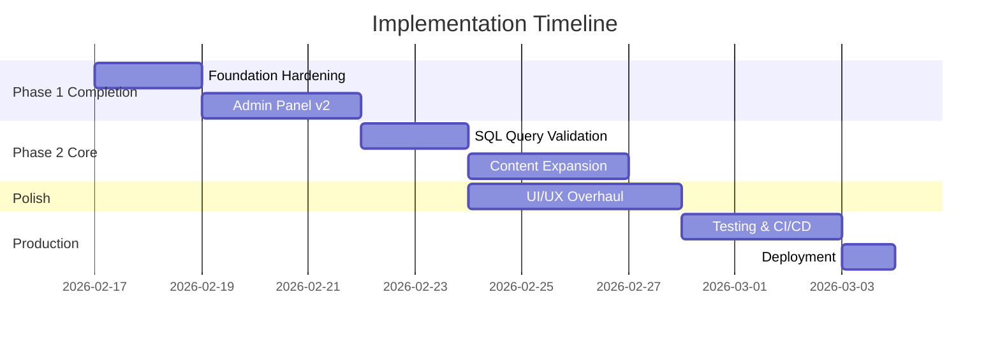

# 📋 Antigravity Data Learning Platform — Implementation Plan

> **⚠️ HISTORICAL — kept for context, no longer the source of truth.**
> This was the working plan as of **2026-02-16**, before the Learn CMS, CONTRIBUTOR role, security hardening, MCP server, UI revamp, and profile redesign shipped. For current architecture see [`TECHNICAL_DESIGN.md`](./TECHNICAL_DESIGN.md). For shipped/planned work see [`ROADMAP.md`](./ROADMAP.md). For per-feature specs and plans see [`superpowers/specs/`](./superpowers/specs/) and [`superpowers/plans/`](./superpowers/plans/).

> **Version:** 1.0
> **Last updated:** 2026-02-16
> **Scope:** Phase 1 Completion + Phase 2 Core Features

---

## Goal

Complete Phase 1 remaining items and build the core Phase 2 features to bring the platform to a production-ready state. Each milestone is designed to be implemented on a **feature branch** and merged via PR.

---

## Milestone 1: Foundation Hardening
**Branch:** `feat/foundation-hardening`  
**Duration:** 1–2 days  
**Goal:** Fix tech debt, add validation, polish the base.

### Tasks

#### 1.1 Fix Metadata & Package Identity
- **[MODIFY]** [package.json](file:///Users/anchitgupta/Documents/Github/datalearn/package.json) — Change `name` from `temp_init` to `datalearn`
- **[MODIFY]** [layout.tsx](file:///Users/anchitgupta/Documents/Github/datalearn/app/layout.tsx) — Update `<title>` and `<meta description>` to reflect Antigravity branding

#### 1.2 Add Zod Validation to Server Actions
- **[MODIFY]** [admin.ts](file:///Users/anchitgupta/Documents/Github/datalearn/actions/admin.ts) — Add Zod schemas for `createPage` form data
- **[MODIFY]** [content.ts](file:///Users/anchitgupta/Documents/Github/datalearn/actions/content.ts) — Validate slug parameters
- **[MODIFY]** [problems.ts](file:///Users/anchitgupta/Documents/Github/datalearn/actions/problems.ts) — Validate slug parameters

#### 1.3 Fix TypeScript Strict Mode
- **[NEW]** `types/next-auth.d.ts` — Proper NextAuth type augmentation to eliminate all `@ts-ignore` usage
- **[MODIFY]** All files with `@ts-ignore` — Remove after type augmentation

#### 1.4 Add Loading & Error States
- **[NEW]** `app/learn/loading.tsx` — Skeleton loading for learn page
- **[NEW]** `app/practice/loading.tsx` — Skeleton loading for practice page
- **[NEW]** `app/error.tsx` — Global error boundary
- **[NEW]** `app/not-found.tsx` — Custom 404 page

---

## Milestone 2: Admin Panel Completion
**Branch:** `feat/admin-panel-v2`  
**Duration:** 2–3 days  
**Goal:** Full CRUD for all content types.

### Tasks

#### 2.1 Topic CRUD
- **[NEW]** `actions/topics.ts` — Server actions: `createTopic`, `updateTopic`, `deleteTopic`
- **[NEW]** `components/admin/TopicForm.tsx` — Form component for topic create/edit
- **[MODIFY]** [admin/page.tsx](file:///Users/anchitgupta/Documents/Github/datalearn/app/admin/page.tsx) — Add topic management section

#### 2.2 Article CRUD
- **[NEW]** `actions/articles.ts` — Server actions: `createArticle`, `updateArticle`, `deleteArticle`, `togglePublish`
- **[NEW]** `components/admin/ArticleForm.tsx` — Form with markdown preview
- **[NEW]** `app/admin/articles/page.tsx` — Article management page
- **[NEW]** `app/admin/layout.tsx` — Admin layout with sidebar navigation

#### 2.3 SQL Problem CRUD
- **[NEW]** `actions/sql-problems.ts` — Server actions: `createProblem`, `updateProblem`, `deleteProblem`
- **[NEW]** `components/admin/ProblemForm.tsx` — Form with schema editor + expected output
- **[NEW]** `app/admin/problems/page.tsx` — Problem management page

#### 2.4 Page Edit/Delete
- **[MODIFY]** [admin.ts](file:///Users/anchitgupta/Documents/Github/datalearn/actions/admin.ts) — Add `updatePage`, `deletePage`, `togglePageActive`
- **[MODIFY]** [admin/page.tsx](file:///Users/anchitgupta/Documents/Github/datalearn/app/admin/page.tsx) — Add edit/delete buttons to page list

---

## Milestone 3: SQL Query Validation
**Branch:** `feat/sql-validation`  
**Duration:** 1–2 days  
**Goal:** Compare user query results against expected output.

### Tasks

#### 3.1 Result Comparison Engine
- **[NEW]** `lib/sql-validator.ts` — Utility: normalize and compare query results against expected output JSON
  - Handle column ordering differences
  - Handle row ordering (when unordered query)
  - Type coercion (string vs number comparisons)

#### 3.2 UI for Validation Feedback
- **[MODIFY]** [SqlPlayground.tsx](file:///Users/anchitgupta/Documents/Github/datalearn/components/sql/SqlPlayground.tsx) — Add "Submit" button alongside "Run"
- **[NEW]** `components/sql/ValidationResult.tsx` — Success/failure badge with diff view
- **[MODIFY]** [ProblemWorkspace.tsx](file:///Users/anchitgupta/Documents/Github/datalearn/components/sql/ProblemWorkspace.tsx) — Pass `expectedOutput` prop to playground, wire submission

#### 3.3 Progress Tracking
- **[MODIFY]** [schema.prisma](file:///Users/anchitgupta/Documents/Github/datalearn/prisma/schema.prisma) — Add `Submission` model (userId, problemId, isCorrect, query, timestamp)
- **[NEW]** `actions/submissions.ts` — Server actions: `submitSolution`, `getUserSubmissions`
- **[MODIFY]** Profile page — Show solved problems count and history

---

## Milestone 4: UI/UX Polish
**Branch:** `feat/ui-overhaul`  
**Duration:** 3–4 days  
**Goal:** Premium, modern design with dark mode.

### Tasks

#### 4.1 Design System
- **[MODIFY]** [globals.css](file:///Users/anchitgupta/Documents/Github/datalearn/app/globals.css) — Define CSS custom properties (colors, spacing, shadows, radii)
- **[NEW]** `components/ui/Button.tsx` — Reusable button component (variants: primary, secondary, ghost, danger)
- **[NEW]** `components/ui/Card.tsx` — Content card with hover effects
- **[NEW]** `components/ui/Badge.tsx` — Difficulty and status badges
- **[NEW]** `components/ui/Input.tsx` — Form input with label and error state
- **[NEW]** `components/ui/Skeleton.tsx` — Loading skeleton component

#### 4.2 Dark Mode
- **[MODIFY]** [layout.tsx](file:///Users/anchitgupta/Documents/Github/datalearn/app/layout.tsx) — Add dark mode toggle, `ThemeProvider`
- **[NEW]** `components/ThemeToggle.tsx` — Sun/moon toggle in navbar
- **[NEW]** `hooks/useTheme.ts` — Theme state management (localStorage + system preference)

#### 4.3 Animations & Interactions
- Add hover effects to cards, buttons, navigation links
- Page transitions with subtle fade-in
- Loading shimmer effects on skeleton components

---

## Milestone 5: Content Expansion
**Branch:** `feat/content-expansion`  
**Duration:** 2–3 days  
**Goal:** Seed realistic content for a compelling demo.

### Tasks

#### 5.1 Learning Content
- **[MODIFY]** [seed.ts](file:///Users/anchitgupta/Documents/Github/datalearn/prisma/seed.ts) — Add 5+ topics with 3+ articles each:
  - Data Warehousing (Star Schema, Slowly Changing Dimensions, Partitioning)
  - ETL Pipelines (Batch vs Stream, CDC, Airflow basics)
  - SQL Mastery (Window Functions, CTEs, Subqueries)
  - NoSQL Concepts (Document vs Columnar, CAP theorem)
  - Data Modeling (Normalization, Denormalization, ER Design)

#### 5.2 SQL Problems
- **[NEW]** `lib/seed-data-hr.ts` — HR database schema (employees, departments, salaries)
- **[NEW]** `lib/seed-data-analytics.ts` — Analytics schema (events, users, sessions)
- **[MODIFY]** [seed.ts](file:///Users/anchitgupta/Documents/Github/datalearn/prisma/seed.ts) — Add 20+ SQL problems across all difficulty levels using multiple schemas

---

## Milestone 6: Testing & CI/CD
**Branch:** `feat/testing-ci`  
**Duration:** 2–3 days  
**Goal:** Establish testing infrastructure and automated pipeline.

### Tasks

#### 6.1 Testing Setup
- **[NEW]** `vitest.config.ts` — Vitest configuration for Next.js
- **[NEW]** `tests/unit/sql-validator.test.ts` — Unit tests for SQL validation logic
- **[NEW]** `tests/unit/actions/*.test.ts` — Unit tests for server actions
- **[NEW]** `tests/e2e/homepage.spec.ts` — Playwright E2E test for homepage
- **[NEW]** `tests/e2e/sql-playground.spec.ts` — Playwright E2E test for SQL execution flow

#### 6.2 CI/CD Pipeline
- **[NEW]** `.github/workflows/ci.yml` — GitHub Actions: lint, type-check, test, build on PR
- **[NEW]** `.github/workflows/deploy.yml` — Auto-deploy to Vercel on merge to `main`

---

## Milestone 7: Deployment
**Branch:** `feat/deployment`  
**Duration:** 1 day  
**Goal:** Production deployment on Vercel.

### Tasks

- Configure Vercel project settings (environment variables, build command)
- Set up PostgreSQL on Railway, Supabase, or Neon
- Configure production OAuth callback URLs (GitHub + Google)
- Add Vercel preview deployments for PRs
- Test production build locally with `npm run build && npm start`

---

## Implementation Order

---

## Branching Strategy

All work follows the branching strategy defined in the project workflows:

1. **Create feature branch** from `main`: `git checkout -b feat/<feature-name> main`
2. **Develop** on the feature branch with atomic commits
3. **Push** and create a Pull Request
4. **Review** and merge to `main`
5. **Delete** the feature branch after merge

> [!IMPORTANT]
> Never commit directly to `main`. All changes go through feature branches.

---

## Verification Plan

### Automated Tests
- **Unit tests:** `npx vitest run` (after Milestone 6)
- **E2E tests:** `npx playwright test` (after Milestone 6)
- **Type checking:** `npx tsc --noEmit`
- **Lint:** `npm run lint`
- **Build verification:** `npm run build`

### Manual Verification
For each milestone, verify in the browser at `http://localhost:3000`:

| Milestone | Manual Check |
|-----------|-------------|
| M1 | Page title shows "Antigravity", no `@ts-ignore` in codebase, loading/error pages work |
| M2 | Admin panel can create/edit/delete topics, articles, problems. Non-admin users are redirected |
| M3 | SQL playground "Submit" button shows ✅/❌, profile page shows solved problems |
| M4 | Dark mode toggle works, UI looks premium, all components use design system |
| M5 | 5+ topics visible on Learn page, 20+ problems on Practice page with varied difficulty |
| M6 | All tests pass in CI, PR triggers automated checks |
| M7 | Production URL accessible, auth works, SQL engine loads |
