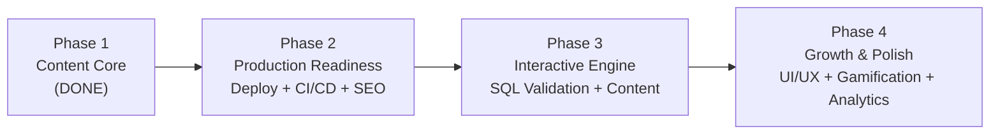

# 🎯 Product Strategy Review — Antigravity Data Learning Platform

> **⚠️ HISTORICAL — strategic snapshot from 2026-02-16, kept for context.**
> The 2026-02-16 review's high-priority recommendations (1–8 in §7) have shipped; a few mid-priority items have evolved. For current state see [`TECHNICAL_DESIGN.md`](./TECHNICAL_DESIGN.md) and [`ROADMAP.md`](./ROADMAP.md). Recent strategic checkpoint added at the top of this doc; original review preserved below.

---

## Strategic checkpoint — 2026-05-10 (v0.4.6)

Three months on from the 2026-02-16 review. Status against the original §7 recommendations table:

| # | 2026-02 recommendation | Status as of v0.4.6 |
|---|---|---|
| 1 | Deploy to production NOW | ✅ Live at https://www.learndatanow.com (since v0.3.0); Neon Postgres; `production` branch is what's deployed; `/api/health` returns commit + DB latency |
| 2 | Content first (30+ problems) | 🟡 Partial — 23 PUBLISHED problems; gap is real but no longer the binding constraint. MCP authoring is now the lever. |
| 3 | Drop Phase 3 (Collaboration) until you have users | ✅ + evolved — real-time collaboration is parked. Async **problem discussions** (forum + voting + moderation) shipped in v0.4.4 instead. |
| 4 | Add SQL validation | ✅ Submit + cross-dialect validator + rate-limited submissions per user |
| 5 | Add user progress tracking | ✅ `Submission` model + profile page + accepted-solve reputation events |
| 6 | SEO: sitemap, meta tags, Open Graph | ✅ Shipped before v0.4.0 |
| 7 | Add basic analytics | ✅ Vercel Speed Insights + Google Analytics in v0.4.5; SQL engine timing telemetry harness in v0.4.6 |
| 8 | Add error monitoring (Sentry) | ❌ Still deferred — Vercel function logs are the current floor; consider Sentry when production traffic warrants it |
| 9 | Cache RSS feed | n/a — RSS feature was removed; learning hub content is server-rendered from Postgres with revalidate |
| 10 | UI overhaul + dark mode | ✅ Hand-rolled shadcn-style design system, light/dark theme with `next-themes`, full design-system handoff bundle in `docs/design-system/` |

**Net:** 8 of 10 shipped. Sentry and content depth remain. The product has cleared the original "is it real" bar — the open questions are different now.

### What's changed since the 2026-02 review

The architecture is multiple times more sophisticated than the original review assumed:

- **Two SQL engines** (DuckDB-WASM + PGlite Postgres-WASM), per-problem dialect choice, per-dialect canonical solutions and expected outputs, cross-dialect equivalence in the validator, IndexedDB-persisted engine state for repeat visits.
- **MCP server** for AI-driven problem authoring via Claude Desktop / Cursor — content velocity unblocked by this rather than by a fully built-out admin GUI.
- **Problem discussions v1** — forum, voting, reputation tiers, moderation queue, MODERATOR role with permission-based capabilities.
- **Engine v2 plan** in `docs/superpowers/plans/2026-05-05-sql-engine-v2-roadmap.md` is the current working plan. Phases 1 + half of 3 are shipped.

### Open strategic questions (2026-05 era)

1. **Trust boundary on submissions.** `validateSubmission` trusts client-provided `userResult` rows. A forged POST gets marked solved. The fix needs server-side SQL execution (sandboxed) or hidden test cases. Both depend on a server runner that's deliberately out of scope today. **Decision needed:** when does this become urgent enough to invest in?
2. **Content scaling.** 23 published problems is enough to validate the platform but not enough to retain serious learners. MCP authoring is the lever — does it need a better-curated prompt library or a content QA pass? Hints data is empty everywhere.
3. **DuckDB cold-start cost.** PGlite persistence (v0.4.6) closes the Postgres repeat-visit cost. DuckDB has no equivalent because there's no upstream OPFS path. PR 3.4 (bundle size investigation, spec shipped) is the next lever; PR 3.1 (warm-up) is the alternative. Both deferred until telemetry has a few weeks of production data.
4. **Validator UX.** Cross-dialect drift, JSON-key-order, timezone equivalence are now handled. Per-problem validation options (case sensitivity, decimal tolerance, etc.) are queued as Phase 4 PR 4.1 — needed before adding harder problem categories.
5. **Phase 6 dialect expansion.** SQLite via `sql.js` is the natural next executable dialect. MySQL parked until a production-grade WASM runtime exists. BigQuery / Snowflake / Redshift would be syntax-only modes. **Decision needed:** when (or whether) to invest in non-executable dialect coverage for interview prep value.

### Recommended next slot (v0.5.x era)

In priority order:

1. **Hint/article content backfill** — every problem currently has empty `hints[]`; learning hub articles are still thin. Direct content investment.
2. **PR 3.1 (engine warm-up)** + **PR 3.4 (DuckDB bundle measurements)** — both close out Phase 3 startup work; needed measurement data is now flowing from the v0.4.6 telemetry harness.
3. **Phase 4 PR 4.1 (per-problem validation options)** — unlocks JSON / decimal / timezone-heavy problem categories.
4. **Trust boundary investment** (server-side SQL runner, hidden test cases) — bigger rock; revisit in v0.5.x or v0.6.x when traffic justifies the infra.
5. **Sentry integration** — small, picks up obvious error noise. Defer unless something burns.

---

## Original review — 2026-02-16 (preserved for archaeology)

> **Reviewer:** PM Analysis
> **Date:** 2026-02-16
> **TL;DR:** The product idea is strong but the phasing strategy needs adjustment. Phase 3 (Collaboration) is too ambitious for a solo-developer project and should be deprioritized. The real moat is **content depth + interactive SQL** — double down there first.

---

## 1. Market Analysis

### Competitive Landscape

| Platform | Strengths | Weaknesses |
|----------|-----------|------------|
| **LeetCode** | Massive SQL problem bank, community, brand | Not data-engineering focused, no learning content |
| **DataLemur** | Data-focused SQL problems, editorial quality | No free SQL engine, limited scope |
| **StrataScratch** | Real interview questions, multiple languages | Paid, no learning hub, no system design |
| **SQLZoo / SQLBolt** | Free, beginner-friendly | Outdated UI, no data engineering context |
| **DataCamp** | Full courses, polished UI | Expensive, walled garden, not open |

### Where Antigravity Can Win

> [!IMPORTANT]
> **Your unique value proposition is the intersection of 3 things:**
> 1. **Free, browser-based SQL engine** with signup (gives you user data + engagement tracking from day one)
> 2. **Data engineering-specific learning content** (not generic SQL)
> 3. **Curated by a practitioner** (you) — personal brand advantage

None of the competitors offer all three. DataLemur has #2 but not #1. LeetCode has #1 but not #2. DataCamp has #2 but not #3.

---

## 2. Strategy Assessment: What's Good ✅

| Decision | Why It's Good |
|----------|---------------|
| **Incremental phases** | Avoids scope creep, ship early, get feedback |
| **DuckDB-WASM (client-side SQL)** | Zero server cost, instant experience, no signup gate |
| **Next.js + Server Components** | SEO-friendly (critical for organic growth), fast |
| **PostgreSQL + Prisma** | Production-grade, type-safe, scales well |
| **Admin panel from day 1** | Enables content velocity — huge for growth |
| **RSS news feed** | Low-effort content freshness, keeps users returning |

---

## 3. Strategy Assessment: What Needs to Change ⚠️

### 3.1 🔴 Phase 3 (Collaboration) Should Be Deprioritized

> [!CAUTION]
> **Real-time collaboration (Socket.io, shared editors, WebSocket rooms) is an entirely different product.** It adds massive complexity, hosting costs, and maintenance burden. For a solo developer, this is a trap.

**Why it doesn't make sense yet:**
- **No users to collaborate with.** Real-time features are only valuable at scale
- **Server infrastructure required.** You'd need persistent WebSocket servers ($$)
- **Excalidraw/tldraw integration** is a multi-week effort for a feature few will use early on
- **Interview prep** already exists on platforms like Pramp, Interviewing.io, and CoderPad

**Recommendation:** Replace Phase 3 entirely. If you want collaboration later, use an off-the-shelf embeddable (Excalidraw's npm package) as a lightweight add-on, not a core feature.

### 3.2 🟡 The Current Phase Order Is Wrong

The current order is:
```
Phase 1: Content → Phase 2: Interactive → Phase 3: Collaboration → Phase 4: Production
```

**The problem:** You're building features before having a production-ready app. Testing, CI/CD, and deployment (Phase 4) should happen **much earlier** — ideally after Phase 1.

**Recommended order:**



**Why?**
1. **Get it live first.** A deployed site with 5 SQL problems beats a local site with 50
2. **SEO compounds over time.** Every day you're not indexed is lost growth
3. **User feedback on a live product** > planning in the dark
4. **Deployment unlocks sharing.** You can put it on your resume/LinkedIn immediately

### 3.3 🟡 Content Is King — You Don't Have Enough

Right now you have:
- **1 topic** (Data Engineering 101)
- **1 article** (What is ETL?)
- **3 SQL problems**

This is the #1 gap. No amount of UI polish matters if there's nothing to practice. 

**Recommendation:** Before any new feature, seed **at least 30 SQL problems** and **10 articles**. This is the single highest-ROI thing you can do.

### 3.4 🟡 Missing: User Progress & Retention Loop

The app currently has no reason for a user to **come back**. There's no:
- Problem completion tracking
- Streak system or daily challenge
- Bookmarking / saved problems
- "You solved X of Y problems" progress bar

**This is more important than collaboration features.** Retention > acquisition.

### 3.5 🟡 Admin-First vs Content-First Paradox

You built an admin panel to create content, but the content is seeded via code (`seed.ts`). The admin panel currently only manages Pages. For Topics, Articles, and SQL Problems, you'd still need to run seed scripts.

**Recommendation:** Either:
- **(A)** Make the admin panel fully functional for all content types (Milestone 2 in the implementation plan), OR
- **(B)** Accept that you're a solo dev and seed everything via code/markdown files — skip the admin panel complexity and use a file-based CMS approach instead

Option B is actually more efficient for a solo developer.

---

## 4. Revised Product Strategy

### New Phasing (Recommended)

#### Phase 1: Content Core ✅ (Done)
*Auth, basic SQL playground, learning hub structure, admin shell*

#### Phase 2: Ship It (NEW — 1 week)
- Deploy to Vercel (production)
- Fix tech debt (TypeScript, metadata, validation)
- SEO optimization (meta tags, sitemap, Open Graph)
- Set up CI/CD (GitHub Actions — lint, type-check, build)
- Mobile responsiveness audit

#### Phase 3: Content Depth (NEW — 2 weeks)
- Seed 30+ SQL problems across 3 schemas (E-commerce, HR, Analytics)
- Write 10+ articles across 5 topics
- SQL query validation (compare user output vs expected)
- Problem difficulty filtering and search
- User progress tracking (submissions model)

#### Phase 4: Growth & Polish (NEW — 2 weeks)
- Design system overhaul (dark mode, premium UI)
- Gamification (streaks, solved count badges, leaderboard)
- Multiple RSS feed sources
- Hint system + editorial solutions
- User profile enhancements (solved history, saved articles)

#### Phase 5: Advanced Features (Future — When You Have Users)
- Python playground (Pyodide)
- System design whiteboard (embed Excalidraw)
- Community features (discussions, comments)
- User analytics dashboard

---

## 5. Tech Stack Assessment

### ✅ Good Choices

| Tech | Verdict |
|------|---------|
| **Next.js 16 (App Router)** | ✅ Perfect — SEO, RSC, server actions, great DX |
| **PostgreSQL** | ✅ Solid — battle-tested, perfect for structured content |
| **Prisma 7** | ✅ Good — type safety, migrations, great for rapid development |
| **DuckDB-WASM** | ✅ Excellent — zero server cost, fast, modern SQL dialect |
| **Tailwind CSS 4** | ✅ Fast development — but needs a design system layer |
| **Zod** | ✅ Good — but it's imported and not used yet elsewhere |

### ⚠️ Concerns

| Tech | Issue | Recommendation |
|------|-------|----------------|
| **NextAuth 5 beta** | Using a beta in production is risky | Acceptable for now, but monitor for breaking changes. Consider pinning the version strictly |
| **`driverAdapters` preview feature** | Prisma preview features can change/break | This is the recommended way for serverless, acceptable risk |
| **No testing framework** | Zero tests is a shipping risk | Add Vitest ASAP — even 5 tests is better than 0 |
| **No error monitoring** | You won't know when things break in prod | Add Sentry (free tier) or Vercel's error tracking |
| **rss-parser** | Server-side RSS fetching on every request | Add caching (ISR with `revalidate`, or in-memory cache) |

### 🔴 Missing Tech (Should Add)

| What | Why | Effort |
|------|-----|--------|
| **Sitemap generation** | Critical for SEO — Google needs to discover your pages | Low (use `next-sitemap`) |
| **Open Graph meta tags** | Required for social sharing (LinkedIn, Twitter) | Low |
| **Analytics** | You need to know if anyone is using this | Low (Vercel Analytics or PostHog free tier) |
| **Caching for RSS** | News feed re-fetches on every page load | Low (Next.js `revalidate` or `unstable_cache`) |
| **Rate limiting** | Server actions are unprotected | Medium |

---

## 6. One-Page Action Plan

If I were the PM, here's the **exact order** I'd prioritize for the next 4 weeks:

### Week 1: Ship to Production
1. Fix metadata (page title, description)
2. Add `next-sitemap` for SEO
3. Deploy to Vercel with PostgreSQL on Neon/Supabase (free tier)
4. Set up GitHub Actions (lint + type-check + build)
5. Add Vercel Analytics

### Week 2: Content Blitz
1. Write/seed 30 SQL problems (10 Easy, 12 Medium, 8 Hard)
2. Write 10 articles across 5 data engineering topics
3. Add SQL query validation (Submit button + comparison)
4. Add difficulty filter to Practice page

### Week 3: Retention Features
1. Add `Submission` model — track solved problems per user
2. Profile page: "X of Y solved" progress bar
3. Practice page: show ✅ next to solved problems
4. Add hint system (collapsible hint per problem)

### Week 4: UI Polish
1. Design system (CSS custom properties, reusable components)
2. Dark mode
3. Hero section redesign with animations
4. Mobile responsiveness

> [!TIP]
> **The golden rule:** Every week should end with something **shippable and visible** to a user. Don't spend 3 weeks on infrastructure before showing anything new.

---

## 7. Summary of Recommendations

| # | Change | Impact | Effort |
|---|--------|--------|--------|
| 1 | **Deploy to production NOW** | 🔴 Critical | Low |
| 2 | **Content first, features second (30+ problems)** | 🔴 Critical | Medium |
| 3 | **Drop Phase 3 (Collaboration) until you have users** | 🟡 High | — (saves time) |
| 4 | **Add SQL validation (Submit button)** | 🟡 High | Medium |
| 5 | **Add user progress tracking** | 🟡 High | Medium |
| 6 | **SEO: sitemap, meta tags, Open Graph** | 🟡 High | Low |
| 7 | **Add basic analytics** | 🟢 Medium | Low |
| 8 | **Add error monitoring (Sentry)** | 🟢 Medium | Low |
| 9 | **Cache RSS feed** | 🟢 Medium | Low |
| 10 | **UI overhaul + dark mode** | 🟢 Medium | High |
